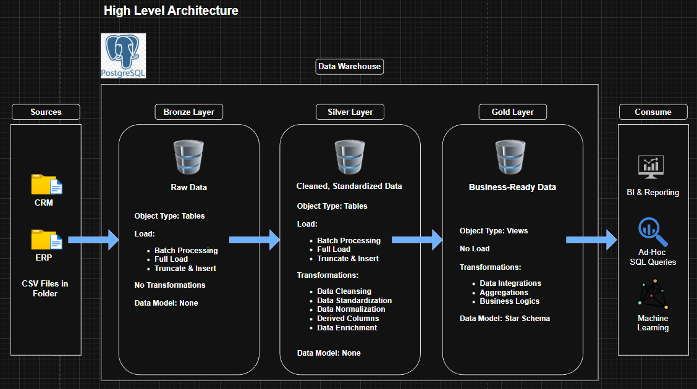
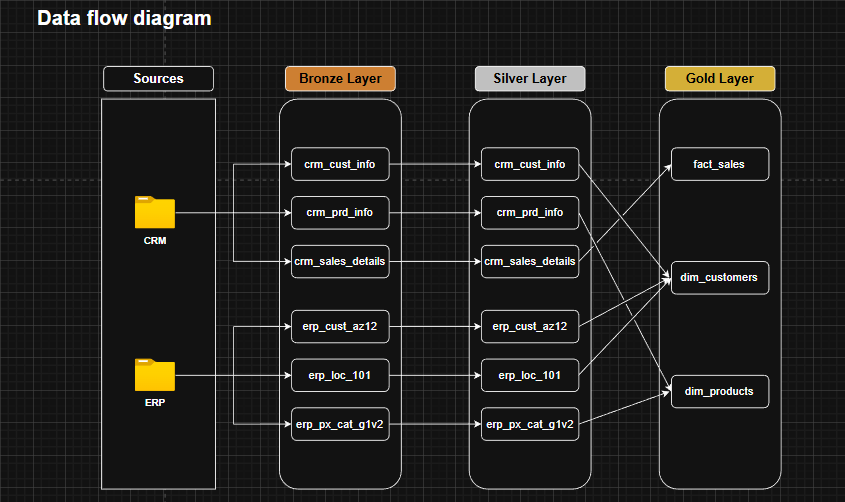
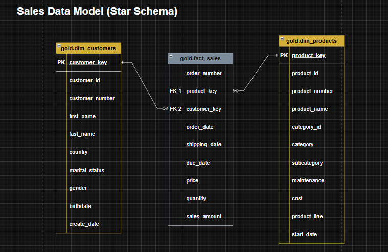
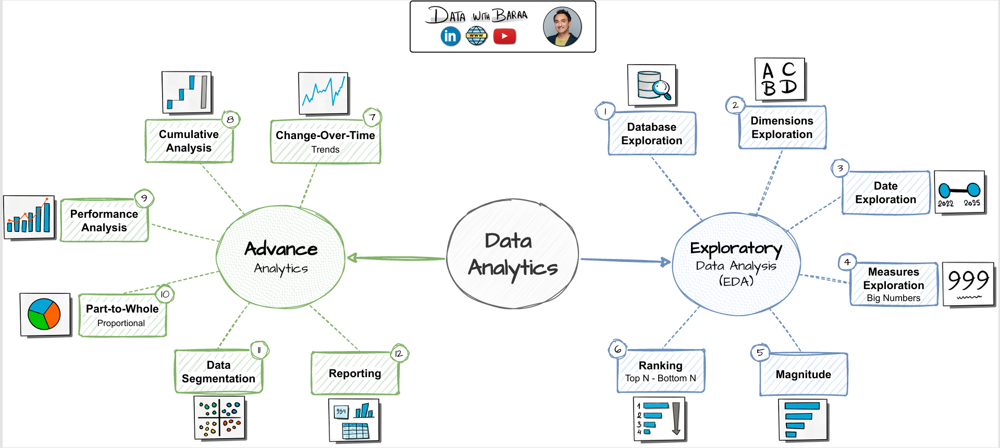

# Data Warehouse and Analytics Project *w/ PostgreSQL*

## Shoutout to Baraa Khatib Salkini for the amazing SQL Course [Click to view course](https://www.youtube.com/watch?v=SSKVgrwhzus)

Welcome to my **Data Warehouse and Analytics Project** repository! 
This project demonstrates a comprehensive data warehousing and analytics solution, from building a data warehouse to generating actionable insights.  

---
## Project Overview

This project involves:  

1. **Data Architecture**: Designing a Modern Data Warehouse Using Medallion Architecture **Bronze**, **Silver**, and **Gold** layers.
2. **ETL Pipelines**: Extracting, transforming, and loading data from source systems into the warehouse.
3. **Data Modeling**: Developing fact and dimension tables optimized for analytical queries.
4. **Analytics & Reporting**: Creating SQL-based reports and dashboards for actionable insights.
---  

## Data Architecture
The data architecture for this project follows Medallion Architecture **Bronze**, **Silver**, and **Gold** layers:  

  

1. **Bronze Layer**: Stores raw data as-is from the source systems. Data is ingested from CSV Files into **Postgres** Database.  
  - [DDL Bronze Layer](scripts/bronze/ddl_bronze.sql)
  - [Procedure Load Bronze](scripts/bronze/procedure_load_bronze.sql)
2. **Silver Layer**: Includes data cleaning, standardization, and normalization processes to prepare data for analysis.
  - [DDL Silver Layer](scripts/silver/ddl_silver.sql)
  - [Procedure Load Silver](scripts/silver/procedure_load_silver.sql)
3. **Gold Layer**: Houses business-ready data modeled into a star schema required for reporting and analytics.
  - [DDL Gold Layer](scripts/gold/ddl_gold.sql)
---

## Data Flow Diagram  

  

## Data Model (Star Schema)

  

---  

## Analytics  

  

**Here are the queries of the analysis:**
-  [Exploratory Data Analysis](analysis_queries/EDA.sql)
-  [Advance Analytics](analysis_queries/advance_analytics)

**Here are the queries of the reports:**
-  [Customers Report](analysis_queries/reports/customers_report.sql)
-  [Products Report](analysis_queries/reports/products_report.sql)
